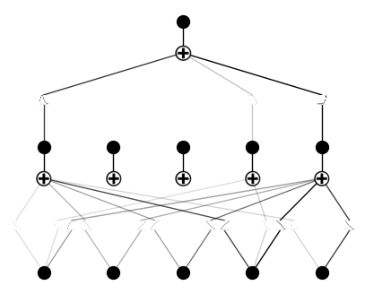

# Investigating the Mpemba Effect with Kolmogorov-Arnold Networks

This repository documents a computational investigation into the Mpemba effect, the counter-intuitive phenomenon where hot water can sometimes freeze faster than cold water. We've applied a novel AI architecture, Kolmogorov-Arnold Networks (KANs), to a physics-based simulation to see if the model could independently identify the key physical mechanisms responsible for the effect.

The project bridges numerical physics simulation with the interpretive power of a new generation of neural networks, aiming not just to predict but to understand the underlying dynamics.

---

## The Mpemba Effect: A Brief Overview

The effect is not a fundamental law but an emergent phenomenon resulting from a complex interplay of heat transfer mechanisms. While it doesn't always occur, its appearance depends heavily on initial conditions. The leading theories point towards processes that are more pronounced in water that starts hotter, such as:

* **Non-linear Convection:** Hotter water has stronger internal convection currents, leading to a faster initial rate of heat loss.
* **Evaporation:** Hotter water evaporates more quickly, which reduces the total mass that needs to be frozen and also causes evaporative cooling.

Our goal was to build a virtual lab that models these effects and then use a KAN to see if it could rediscover these theories from the data alone.

---

## Methodology

Our approach was a two-stage process: a simulation phase followed by a machine learning analysis phase.

### 1. Numerical Simulation

We developed a physical model based on a system of coupled ordinary differential equations to simulate the cooling of a water sample. The model is built on Newton's law of cooling but incorporates two critical non-linear factors:

* **Temperature-Dependent Convection:** The heat transfer coefficient `h` was modeled as a function of the temperature difference, `h ∝ (T - T_env)^n`, allowing for more aggressive cooling at higher temperatures.
* **Mass Loss via Evaporation:** The mass `m` of the water was allowed to decrease over time, with the rate of evaporation `dm/dt` modeled as a function of the water's vapor pressure, which is highly sensitive to temperature.

We ran 4,000 simulations, each with randomized initial conditions (`T_initial`, `T_env`) and physical parameters (`h_base`, `h_exponent`, `K_evap`), to generate a comprehensive dataset of freezing times.

### 2. KAN Analysis

The generated dataset was used to train a Kolmogorov-Arnold Network. We intentionally chose a relatively simple architecture (`[5, 5, 1]`) to challenge the model to find efficient representations.

The most critical step was using the network's **pruning** capability. After training, we tasked the model with automatically removing redundant or unimportant connections. The resulting simplified (pruned) network reveals which input parameters have the most significant influence on the final freezing time.

---

## Results and Key Findings

The pruned KAN model provided a clear and insightful result, effectively acting as an unbiased scientific analyst.



### Interpretation of the Model

The final architecture of the network points to a definitive conclusion.

1.  **Dominant Factors Identified:** The model pruned away most connections but retained **strong, significant links** from the **convection exponent (`h_exponent`)** and the **evaporation coefficient (`K_evap`)**.

2.  **The Role of Initial Temperature:** In contrast, the direct link from the initial temperature (`T_initial`) was severely weakened or entirely removed.

This is the central finding of my investigation. The KAN concluded that the initial temperature is not the direct cause of the phenomenon. Instead, it's an **enabling factor** that amplifies the true drivers: **non-linear convection** and **evaporation**. The model independently rediscovered the core concepts of the leading physical theories explaining the effect. The attempt to extract a single symbolic formula failed, which itself is a significant result, suggesting that the parameter interactions are too complex to be captured by a simple algebraic expression.

---

## How to Run This Project

The project is structured into two separate Jupyter Notebooks.

1.  **Clone the repository:**
    ```bash
    git clone https://github.com/aryan-salemababdi/Mpemba-Effect.git
    cd mpemba-effect
    ```

2.  **Step 1: Generate the Data**
    Open and run all cells in the `simulate_data.ipynb` notebook. This will execute the numerical simulations and save the output to `data/mpemba_data.csv`. This step may take several minutes.

3.  **Step 2: Train the KAN Model**
    Once the data is generated, open and run all cells in the `train_model.ipynb` notebook. This will load the data, train the KAN, and save the resulting pruned


---

## Technologies Used
* Python
* Jupyter Notebook
* PyTorch
* PyKAN
* NumPy & Pandas
* Scikit-learn
* Matplotlib
* Git & GitHub